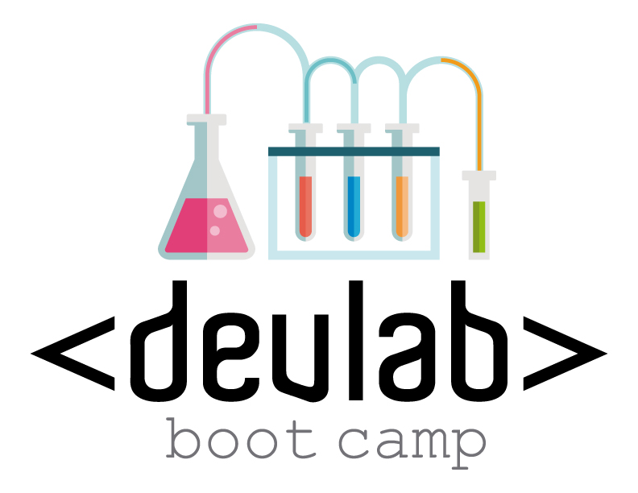

#Reglas

##Tiempo de entrega
5 semanas.

##Medición del desempeño

1. Revisión del código después de cada práctica o sprint.
2. Se brindará un peso por cada ejercicio entregado.

##Herramientas

1. Por lo menos, tres navegadores diferentes instalados en la máquina del desarrollador. Ejemplo, Chrome, Firefox y el navegador de Android con el emulador de Android.
2. El IDE a utilizar es con el que se sienta mejor.
3. Cree su propia cuenta de GitHub con el correo de Komet. La cual estará asociada a los Code Review.
4. Descargar NodeJS.
5. Instale su propio servidor NodeJS.
6. Instalar http-server globalmente --> npm install -g http-server.
7. Fork al repo para usar como base del proyecto, dependiendo del level a cursar.
8. Para iniciar el servidor, desde una interfaz de línea de comandos, ejecutar http-server en el directorio donde clonará el repositorio.
9. Abra su navegador web y apunte a localhost: PORT (el servidor http debería haber emitido el número de puerto que debe usar).

##Días de Aprendizaje
* [Level 1: Conceptos básicos de HTML, CSS JavaScript y API de DOM](https://github.com/kometsales/web-ui/tree/master/level-1)
* [Level 2: OOP y herencia en JavaScript](https://github.com/kometsales/web-ui/tree/master/level-2)
* Level 3: MVC - AngularJS
* Level 4: API de HTML5
* Level 5: UI - ReactJS → Coming soon!
